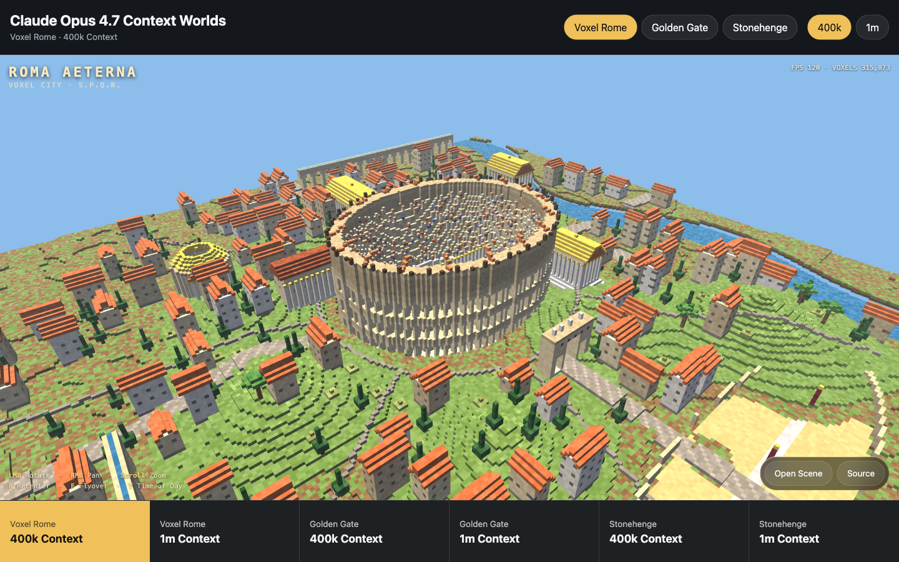

# Claude Opus 4.7 Context Worlds

Interactive static showcase comparing the same scene prompts generated with Claude Opus 4.7 at two context windows:

- `400k Context`
- `1m Context`

## Scenes

| Prompt | 400k source | 1m source |
| --- | --- | --- |
| Voxel Rome | `scenes/voxel-rome-400k/` | `scenes/voxel-rome-1m/` |
| Golden Gate | `scenes/golden-gate-400k/` | `scenes/golden-gate-1m/` |
| Stonehenge | `scenes/stonehenge-400k/` | `scenes/stonehenge-1m/` |

## Source Mapping

The public scene folders were copied from:

- `/Users/peter/roman-voxel-city` -> `scenes/voxel-rome-400k`
- `/Users/peter/rome-voxel` -> `scenes/voxel-rome-1m`
- `/Users/peter/golden-gate-scene` -> `scenes/golden-gate-400k`
- `/Users/peter/golden-gate-bridge` -> `scenes/golden-gate-1m`
- `/Users/peter/stonehenge-scene` -> `scenes/stonehenge-400k`
- `/Users/peter/stonehenge_solstice` -> `scenes/stonehenge-1m`

Note: `http://localhost:8765/` was traced to `/Users/peter/stonehenge_solstice`, despite being labeled as Golden Gate in the working note.

## Run Locally

This is a static site. Serve the repo root with any local static server and open `index.html`.

## Publish

Recommended sharing path: GitHub Pages from the repo root on the `main` branch. The site has no build step, so Pages can publish it directly.

## License

MIT License.
